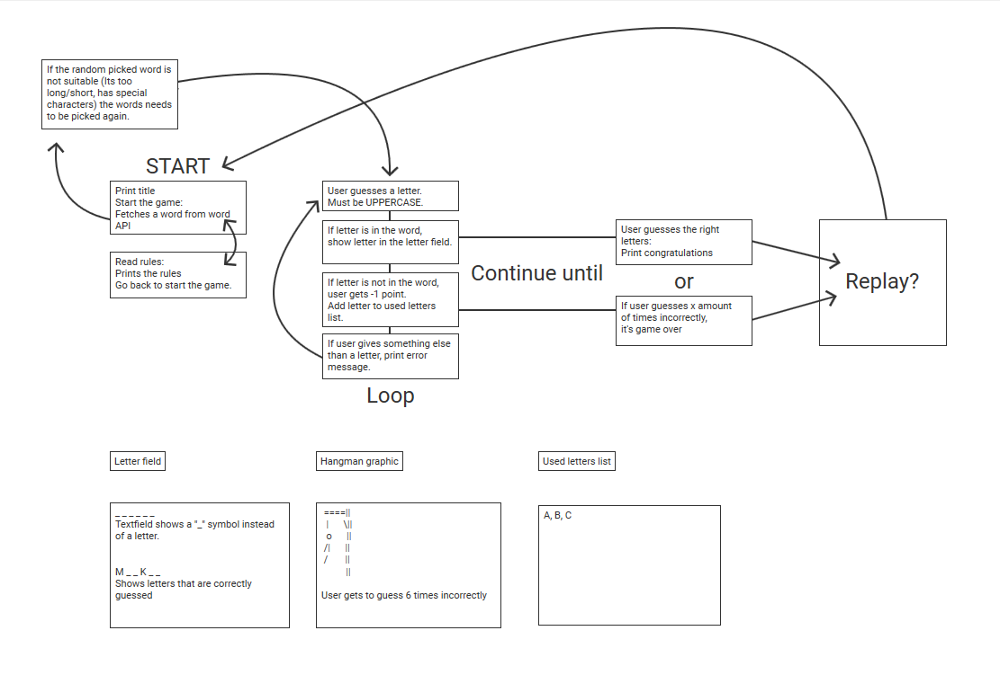
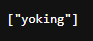

# Hangman game

## Strategy
Hangman is a classic word-guessing game, where user has to guess the right word. If user guesses wrong six times, it's game over.
If user guesses right they win. This game is suitable for anyone who understands english language. User will most likely wish to challenge themselves, and be entertained.

## Scope
Game lets the user to guess untill they get the word right, or until they guess wrong six times. Game is unlimitedly replayable, as long as there is words left.

### User goals:
What is their goal? What problem does this product or feature solve for them?
- It's a game, and user wants to be challenged and entertained.

### User Stories:
- As a user I can start the game.
- As a user I can find more information about how to play the game.
- As a user I can guess a letter.
- As a user I can choose to replay.

## Structure and skeleton

### Structure of the game
Original plan for the game

Welcome:
When game is started, it first greets the user with logo, and option to start the game right away or read the rules first.

Rules:

The game:
The main game loop lets user to input a letter. If the letter is in the word, it is shown in the  letter field in correct spot. 
If letter is incorrect, it's added to the used letters list, and user loses a point.
Game continues until all the letters in a word are guessed and word is revealed, or until user guesses wrong six times.

Replay:
User can replay by choosing "Yes".
If user chooses "No", it takes them to the start screen.

## Skeleton:

## Surface:

## TESTING

### As a user I can start the game.
### As a user I can find more information about how to play the game.
### As a user I can guess a letter.
### As a user I can choose to replay.### Bugs and other issues:

### Fixed Issues
- Word prints down as a column. FIX: add **end=" "** to print statement to make it a row.

### Not fixed
- When turning letters of the word to underscore, word_to_blank function returns 10 character instead of 6. Since this clearly isn't working, I'll just change the function. Is it counting "" and []-characters? How to remove those? Where are they even coming from? The extra symbols are coming from the API. Like this: 

- Creating a infinite loop when guessing a letter.

- Only showing the first correctly guessed letter
- Showing the whole word when guessing a letter

### Testing with code validators

### DEPLOYMENT
- Site was deployed to **Github Pages**.
- From Github, I chose the current project **Hangman-game** and **Settings**.
- On the leftside of the page there is **Pages**.
- Choose the **Main** branch
- Site will be published.
- This site is published at:

## CREDITS

### Validators:

### Other things I used while coding this game:

Balsamiq wireframes

[Text to ASCII generator](https://patorjk.com/software/taag)

